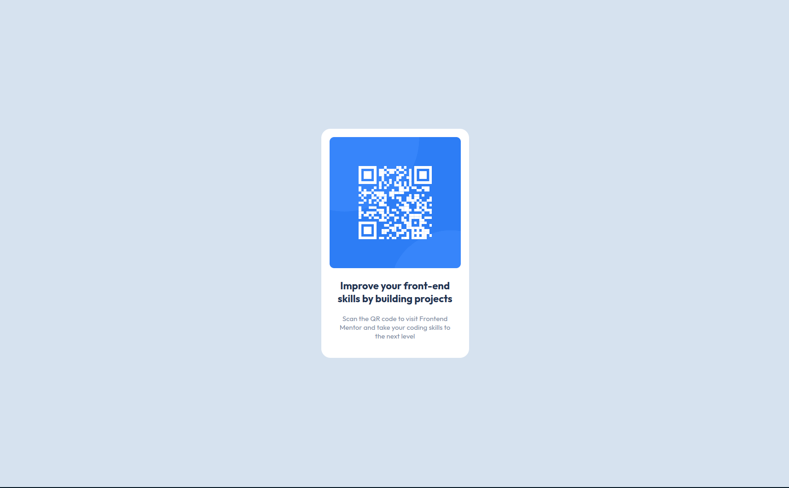

# Frontend Mentor - QR code component solution

This is a solution to the [QR code component challenge on Frontend Mentor](https://www.frontendmentor.io/challenges/qr-code-component-iux_sIO_H). Frontend Mentor challenges help you improve your coding skills by building realistic projects. 

## Table of contents

- [Overview](#overview)
  - [Screenshot](#screenshot)
  - [Links](#links)
- [My process](#my-process)
  - [Built with](#built-with)
  - [What I learned](#what-i-learned)
- [Author](#author)

## Overview

### Screenshot




### Links

- Solution URL: [LINK](https://github.com/Mechelon404/FrontendMentor-QRcode)
- Live Site URL: [LINK](https://mechelon404.github.io/FrontendMentor-QRcode/)

## My process

### Built with

- HTML5
- CSS Flexbox

### What I learned

Practised my CSS alignment and flexbox skills

```css
html,
body {
    height: 100%;
    width: 100%;
}
```
Learned about image-rendering to sharpen picture

```css
img {
    max-width: 100%;
    border-radius: 10px;
    image-rendering: pixelated;
}
```

## Author

- Frontend Mentor - [@Mechelon404](https://www.frontendmentor.io/profile/Mechelon404)